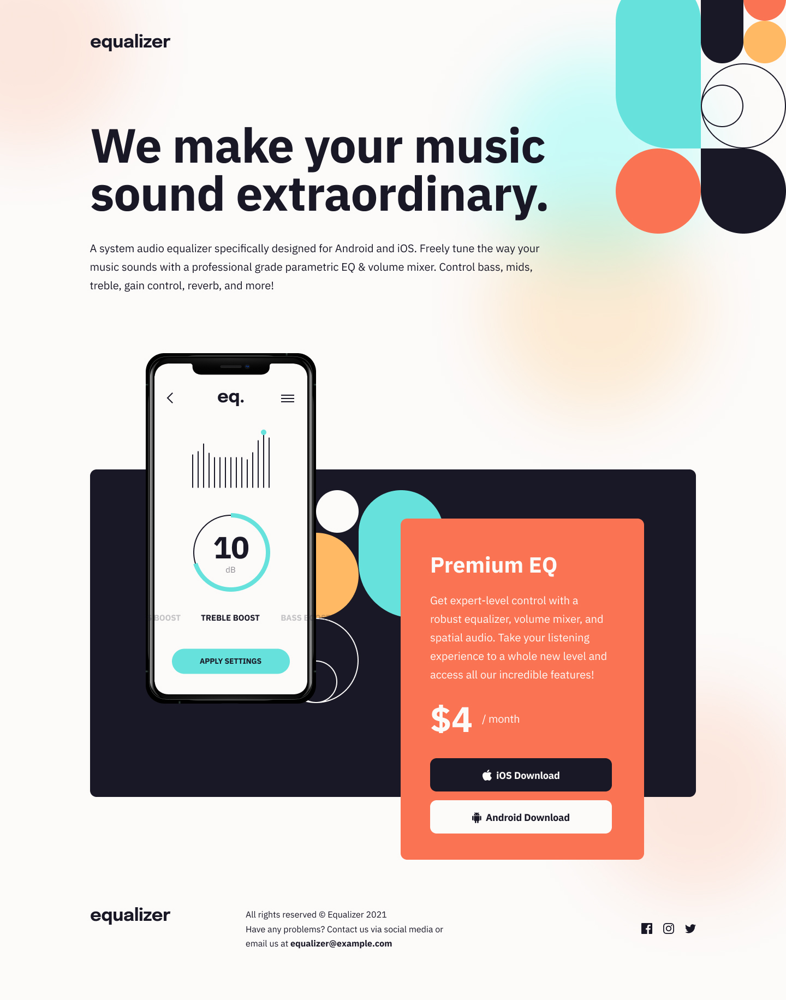

<h1>Equalizer Landing Page</h1>

This is my first project using Javascript and it helped me   understand fundamentals of DOM and Event Handlers.

[Live URL](https://ivaberiashvili.github.io/equalizer-landing-page/) | [Solution]() | [Challenge on Frontend Mentor](https://www.frontendmentor.io/challenges/equalizer-landing-page-7VJ4gp3DE)
:-------------------------:|:-------------------------:|:-------------------------:

## The challenge

Users should be able to:
- View the optimal layout depending on their device's screen size
- See hover states for interactive elements

## The Solution

### Built with

- Semantic HTML5 markup
- CSS custom properties
- Flexbox
- CSS Grid
- Mobile-first workflow

### Author
- [Iva](https://github.com/ivaberiashvili/)

